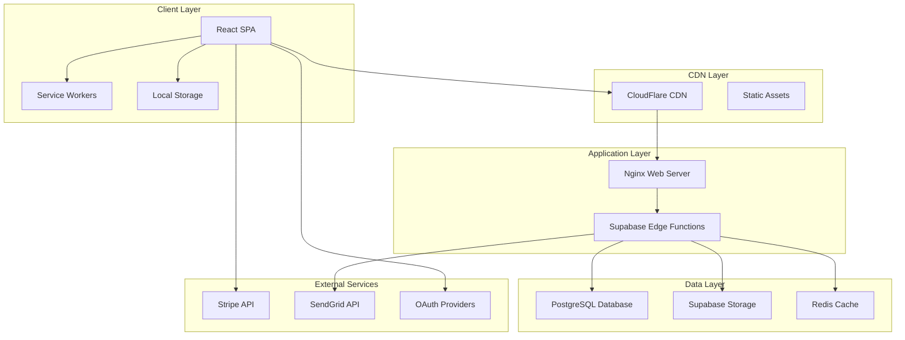

# Blessed Horizon - Current Architecture

## Overview

The Blessed Horizon platform is a modern web application built with cutting-edge technologies to provide a seamless, secure, and scalable crowdfunding platform for charitable causes.

## Technology Stack

### Frontend
- **Framework**: React 18.3 with TypeScript
- **Build Tool**: Vite 6.0
- **Styling**: Tailwind CSS 3.4
- **State Management**: React Context API + Hooks
- **Routing**: React Router v7
- **UI Components**: Custom components with Radix UI primitives
- **Internationalization**: react-i18next for multi-language support

### Backend & Infrastructure
- **Database**: Supabase (PostgreSQL)
- **Authentication**: Supabase Auth with OAuth providers
- **Storage**: Supabase Storage for media files
- **Real-time**: Supabase Realtime for live updates
- **Edge Functions**: Supabase Edge Functions for serverless operations
- **Payment Processing**: Stripe for secure transactions
- **Email Service**: SendGrid for transactional emails
- **Push Notifications**: Web Push API with service workers

### Development & Deployment
- **Version Control**: Git with GitHub
- **CI/CD**: GitHub Actions
- **Hosting**: 
  - Production: Namecheap VPS with Nginx
  - Development: Local development server
- **Monitoring**: Grafana + Prometheus
- **Error Tracking**: Sentry integration
- **Analytics**: Google Analytics 4

## Architecture Diagram



## Key Features Architecture

### 1. **Authentication & Authorization**
- Multi-provider OAuth (Google, Facebook, Twitter)
- Email/password authentication
- Role-based access control (RBAC)
- Session management with JWT tokens
- Secure password reset flow

### 2. **Campaign Management**
- Dynamic campaign creation with rich media
- Multi-stage approval workflow
- Real-time progress tracking
- Automated status updates
- Media optimization pipeline

### 3. **Payment Processing**
- PCI-compliant payment flow via Stripe
- Support for one-time and recurring donations
- Multi-currency support
- Automated receipt generation
- Refund management system

### 4. **Trust & Safety**
- Multi-factor trust scoring algorithm
- Content moderation with AI assistance
- Community reporting system
- Fraud detection mechanisms
- Identity verification for campaign creators

### 5. **Real-time Features**
- Live donation updates
- Campaign progress notifications
- Real-time comment system
- Instant messaging for supporters
- Live streaming integration ready

### 6. **Analytics & Reporting**
- Comprehensive dashboard for campaign creators
- Donor analytics and insights
- Platform-wide metrics for administrators
- Custom report generation
- Data export capabilities

## Security Architecture

### Authentication Security
- Secure token storage
- CSRF protection
- XSS prevention
- SQL injection protection
- Rate limiting on auth endpoints

### Data Security
- End-to-end encryption for sensitive data
- PII encryption at rest
- Secure API endpoints with authentication
- Regular security audits
- GDPR compliance measures

### Infrastructure Security
- SSL/TLS encryption
- Web Application Firewall (WAF)
- DDoS protection via CloudFlare
- Regular security patches
- Intrusion detection system

## Performance Optimizations

### Frontend Performance
- Code splitting and lazy loading
- Image optimization and WebP support
- Service worker caching strategies
- Bundle size optimization
- Critical CSS inlining

### Backend Performance
- Database query optimization
- Connection pooling
- Caching strategies (Redis)
- CDN for static assets
- Gzip compression

### Scalability Measures
- Horizontal scaling capability
- Load balancing ready
- Database read replicas
- Caching at multiple levels
- Asynchronous job processing

## Monitoring & Observability

### Application Monitoring
- Real User Monitoring (RUM)
- Application Performance Monitoring (APM)
- Error tracking and alerting
- Custom metrics dashboard
- Log aggregation

### Infrastructure Monitoring
- Server health metrics
- Database performance monitoring
- Network traffic analysis
- Resource utilization tracking
- Automated alerting system

## Deployment Pipeline

### Development Workflow
1. Feature branch development
2. Automated testing (Jest, Cypress)
3. Code review process
4. Merge to main branch
5. Automated deployment

### CI/CD Pipeline
```yaml
stages:
  - lint
  - test
  - build
  - security-scan
  - deploy
  - smoke-test
  - rollback-ready
```

### Deployment Strategy
- Blue-green deployment
- Automated rollback capability
- Database migration automation
- Zero-downtime deployments
- Feature flag management

## Disaster Recovery

### Backup Strategy
- Daily automated database backups
- Media files backup to S3
- Configuration backups
- Backup restoration testing
- 30-day retention policy

### Recovery Procedures
- RTO: 4 hours
- RPO: 1 hour
- Automated failover capability
- Disaster recovery documentation
- Regular DR drills

## Future-Ready Architecture

The current architecture is designed with future scalability in mind:

1. **Microservices Ready**: Clean separation of concerns
2. **API-First Design**: RESTful APIs ready for expansion
3. **Event-Driven**: Prepared for event sourcing
4. **Cloud-Native**: Easy migration to cloud platforms
5. **Containerization Ready**: Docker-compatible structure

## Conclusion

The Blessed Horizon platform's architecture provides a solid foundation for a secure, scalable, and maintainable crowdfunding platform. The technology choices balance modern capabilities with proven reliability, ensuring the platform can grow with user demands while maintaining high performance and security standards.
