# CI/CD Pipeline Documentation

## Overview

This document describes the continuous integration and continuous deployment (CI/CD) pipeline for Blessed Horizon's microservices architecture. The pipeline ensures code quality, security, and reliable deployments across all environments.

## 1. Pipeline Architecture

### 1.1 Technology Stack

- **Version Control**: GitHub
- **CI/CD Platform**: GitHub Actions + ArgoCD
- **Container Registry**: Amazon ECR
- **Security Scanning**: Snyk, Trivy, SonarQube
- **Deployment**: ArgoCD (GitOps)
- **Monitoring**: Datadog, Prometheus

### 1.2 Pipeline Overview

```mermaid
graph LR
    A[Developer Push] --> B[GitHub]
    B --> C[GitHub Actions]
    C --> D[Build & Test]
    D --> E[Security Scan]
    E --> F[Container Build]
    F --> G[Push to ECR]
    G --> H[Update Manifests]
    H --> I[ArgoCD Sync]
    I --> J[Deploy to K8s]
    J --> K[Health Checks]
    K --> L[Monitoring]
```



## 2. GitHub Actions Workflows

### 2.1 Main CI Pipeline

```yaml
name: CI Pipeline

on:
  push:
    branches: [main, develop]
  pull_request:
    branches: [main, develop]

env:
  ECR_REPOSITORY: blessed-horizon
  AWS_REGION: us-east-1

jobs:
  lint-and-test:
    runs-on: ubuntu-latest
    strategy:
      matrix:
        service: [campaign-service, payment-service, notification-service, trust-service]
    
    steps:
    - uses: actions/checkout@v3
    
    - name: Setup Node.js
      uses: actions/setup-node@v3
      with:
        node-version: '18'
        cache: 'npm'
    
    - name: Install dependencies
      run: |
        cd services/${{ matrix.service }}
        npm ci
    
    - name: Run linter
      run: |
        cd services/${{ matrix.service }}
        npm run lint
    
    - name: Run tests
      run: |
        cd services/${{ matrix.service }}
        npm run test:ci
    
    - name: Upload coverage
      uses: codecov/codecov-action@v3
      with:
        file: ./services/${{ matrix.service }}/coverage/lcov.info
        flags: ${{ matrix.service }}
    
  security-scan:
    runs-on: ubuntu-latest
    needs: lint-and-test
    
    steps:
    - uses: actions/checkout@v3
    
    - name: Run Snyk security scan
      uses: snyk/actions/node@master
      env:
        SNYK_TOKEN: ${{ secrets.SNYK_TOKEN }}
      with:
        args: --severity-threshold=high
    
    - name: Run SAST with SonarQube
      uses: SonarSource/sonarcloud-github-action@master
      env:
        GITHUB_TOKEN: ${{ secrets.GITHUB_TOKEN }}
        SONAR_TOKEN: ${{ secrets.SONAR_TOKEN }}
    
  build-and-push:
    runs-on: ubuntu-latest
    needs: [lint-and-test, security-scan]
    if: github.event_name == 'push'
    strategy:
      matrix:
        service: [campaign-service, payment-service, notification-service, trust-service]
    
    steps:
    - uses: actions/checkout@v3
    
    - name: Configure AWS credentials
      uses: aws-actions/configure-aws-credentials@v2
      with:
        aws-access-key-id: ${{ secrets.AWS_ACCESS_KEY_ID }}
        aws-secret-access-key: ${{ secrets.AWS_SECRET_ACCESS_KEY }}
        aws-region: ${{ env.AWS_REGION }}
    
    - name: Login to Amazon ECR
      id: login-ecr
      uses: aws-actions/amazon-ecr-login@v1
    
    - name: Build Docker image
      env:
        ECR_REGISTRY: ${{ steps.login-ecr.outputs.registry }}
        IMAGE_TAG: ${{ github.sha }}
      run: |
        cd services/${{ matrix.service }}
        docker build -t $ECR_REGISTRY/$ECR_REPOSITORY/${{ matrix.service }}:$IMAGE_TAG \
          --build-arg BUILD_DATE=$(date -u +'%Y-%m-%dT%H:%M:%SZ') \
          --build-arg VCS_REF=${{ github.sha }} \
          --build-arg VERSION=${{ github.ref_name }}-${{ github.sha }} \
          .
    
    - name: Scan image with Trivy
      uses: aquasecurity/trivy-action@master
      with:
        image-ref: ${{ steps.login-ecr.outputs.registry }}/${{ env.ECR_REPOSITORY }}/${{ matrix.service }}:${{ github.sha }}
        format: 'sarif'
        output: 'trivy-results.sarif'
    
    - name: Upload Trivy scan results
      uses: github/codeql-action/upload-sarif@v2
      with:
        sarif_file: 'trivy-results.sarif'
    
    - name: Push to ECR
      env:
        ECR_REGISTRY: ${{ steps.login-ecr.outputs.registry }}
        IMAGE_TAG: ${{ github.sha }}
      run: |
        docker push $ECR_REGISTRY/$ECR_REPOSITORY/${{ matrix.service }}:$IMAGE_TAG
        docker tag $ECR_REGISTRY/$ECR_REPOSITORY/${{ matrix.service }}:$IMAGE_TAG \
          $ECR_REGISTRY/$ECR_REPOSITORY/${{ matrix.service }}:latest
        docker push $ECR_REGISTRY/$ECR_REPOSITORY/${{ matrix.service }}:latest
```

### 2.2 Update Deployment Manifests

```yaml
name: Update K8s Manifests

on:
  workflow_run:
    workflows: ["CI Pipeline"]
    types:
      - completed
    branches: [main]

jobs:
  update-manifests:
    runs-on: ubuntu-latest
    if: ${{ github.event.workflow_run.conclusion == 'success' }}
    
    steps:
    - uses: actions/checkout@v3
      with:
        repository: blessed-horizon/k8s-manifests
        token: ${{ secrets.MANIFEST_REPO_TOKEN }}
    
    - name: Update image tags
      run: |
        for service in campaign-service payment-service notification-service trust-service; do
          sed -i "s|image: .*${service}:.*|image: ${{ secrets.ECR_REGISTRY }}/blessed-horizon/${service}:${{ github.sha }}|g" \
            environments/production/${service}/deployment.yaml
        done
    
    - name: Commit and push changes
      run: |
        git config --global user.name "GitHub Actions"
        git config --global user.email "actions@github.com"
        git add .
        git commit -m "Update image tags to ${{ github.sha }}"
        git push
```

## 3. ArgoCD Configuration

### 3.1 Application Definition

```yaml
apiVersion: argoproj.io/v1alpha1
kind: Application
metadata:
  name: blessed-horizon-prod
  namespace: argocd
  finalizers:
    - resources-finalizer.argocd.argoproj.io
spec:
  project: blessed-horizon
  source:
    repoURL: https://github.com/blessed-horizon/k8s-manifests
    targetRevision: main
    path: environments/production
  destination:
    server: https://kubernetes.default.svc
    namespace: blessed-horizon
  syncPolicy:
    automated:
      prune: true
      selfHeal: true
      allowEmpty: false
    syncOptions:
    - Validate=true
    - CreateNamespace=true
    - PrunePropagationPolicy=foreground
    - PruneLast=true
    retry:
      limit: 5
      backoff:
        duration: 5s
        factor: 2
        maxDuration: 3m
```

### 3.2 Progressive Delivery with Flagger

```yaml
apiVersion: flagger.app/v1beta1
kind: Canary
metadata:
  name: campaign-service
  namespace: blessed-horizon
spec:
  targetRef:
    apiVersion: apps/v1
    kind: Deployment
    name: campaign-service
  progressDeadlineSeconds: 600
  service:
    port: 80
    targetPort: 8080
    gateways:
    - public-gateway.istio-system.svc.cluster.local
    hosts:
    - api.blessedhorizon.org
  analysis:
    interval: 1m
    threshold: 5
    maxWeight: 50
    stepWeight: 10
    metrics:
    - name: request-success-rate
      thresholdRange:
        min: 99
      interval: 1m
    - name: request-duration
      thresholdRange:
        max: 500
      interval: 1m
    webhooks:
    - name: load-test
      url: http://flagger-loadtester.test/
      timeout: 5s
      metadata:
        cmd: "hey -z 1m -q 10 -c 2 http://api.blessedhorizon.org/api/v1/campaigns"
```

## 4. Environment Management

### 4.1 Environment Promotion

```yaml
name: Promote to Production

on:
  workflow_dispatch:
    inputs:
      version:
        description: 'Version to promote'
        required: true
      environment:
        description: 'Target environment'
        required: true
        default: 'production'
        type: choice
        options:
        - staging
        - production

jobs:
  promote:
    runs-on: ubuntu-latest
    environment: ${{ github.event.inputs.environment }}
    
    steps:
    - uses: actions/checkout@v3
      with:
        repository: blessed-horizon/k8s-manifests
        token: ${{ secrets.MANIFEST_REPO_TOKEN }}
    
    - name: Promote version
      run: |
        SOURCE_ENV=$([ "${{ github.event.inputs.environment }}" == "production" ] && echo "staging" || echo "development")
        cp -r environments/${SOURCE_ENV}/* environments/${{ github.event.inputs.environment }}/
        
        # Update version labels
        find environments/${{ github.event.inputs.environment }} -name "*.yaml" -type f -exec \
          sed -i "s/version: .*/version: ${{ github.event.inputs.version }}/g" {} +
    
    - name: Create Pull Request
      uses: peter-evans/create-pull-request@v4
      with:
        token: ${{ secrets.MANIFEST_REPO_TOKEN }}
        commit-message: "Promote ${{ github.event.inputs.version }} to ${{ github.event.inputs.environment }}"
        title: "Promote ${{ github.event.inputs.version }} to ${{ github.event.inputs.environment }}"
        body: |
          Promoting version ${{ github.event.inputs.version }} to ${{ github.event.inputs.environment }}
          
          Please review the changes and merge when ready.
        branch: promote-${{ github.event.inputs.version }}-to-${{ github.event.inputs.environment }}
```

## 5. Database Migration Pipeline

### 5.1 Migration Job

```yaml
apiVersion: batch/v1
kind: Job
metadata:
  name: db-migration-{{ .Values.version }}
  namespace: blessed-horizon
spec:
  template:
    spec:
      restartPolicy: Never
      initContainers:
      - name: wait-for-db
        image: busybox:1.35
        command: ['sh', '-c', 'until nc -z postgres-service 5432; do sleep 1; done']
      containers:
      - name: migrate
        image: {{ .Values.registry }}/blessed-horizon/db-migrate:{{ .Values.version }}
        env:
        - name: DATABASE_URL
          valueFrom:
            secretKeyRef:
              name: db-credentials
              key: url
        - name: MIGRATION_DIR
          value: /migrations
        command: ["migrate"]
        args: ["-path", "/migrations", "-database", "$(DATABASE_URL)", "up"]
```

## 6. Rollback Strategy

### 6.1 Automated Rollback

```yaml
name: Automated Rollback

on:
  repository_dispatch:
    types: [deployment-failed]

jobs:
  rollback:
    runs-on: ubuntu-latest
    
    steps:
    - name: Rollback ArgoCD Application
      run: |
        argocd app rollback blessed-horizon-prod --revision ${{ github.event.client_payload.previous_revision }}
    
    - name: Notify team
      uses: 8398a7/action-slack@v3
      with:
        status: ${{ job.status }}
        text: 'Automated rollback initiated for blessed-horizon-prod'
        webhook_url: ${{ secrets.SLACK_WEBHOOK }}
```

## 7. Quality Gates

### 7.1 Pre-deployment Checks

```yaml
quality_gates:
  code_coverage:
    threshold: 80%
    required: true
    
  security_vulnerabilities:
    critical: 0
    high: 0
    medium: 5
    
  performance_tests:
    p95_latency: 100ms
    error_rate: 0.1%
    
  integration_tests:
    pass_rate: 100%
    
  load_tests:
    requests_per_second: 1000
    concurrent_users: 100
```

## 8. Monitoring and Alerts

### 8.1 Deployment Metrics

```yaml
metrics:
  - deployment_frequency:
      target: "multiple per day"
      measurement: "deployments per day"
      
  - lead_time:
      target: "< 1 hour"
      measurement: "commit to production"
      
  - mttr:
      target: "< 30 minutes"
      measurement: "incident to resolution"
      
  - change_failure_rate:
      target: "< 5%"
      measurement: "failed deployments / total deployments"
```

### 8.2 Alert Configuration

```yaml
apiVersion: monitoring.coreos.com/v1
kind: PrometheusRule
metadata:
  name: deployment-alerts
  namespace: monitoring
spec:
  groups:
  - name: deployment
    interval: 30s
    rules:
    - alert: DeploymentFailed
      expr: |
        kube_deployment_status_replicas_available{namespace="blessed-horizon"} /
        kube_deployment_spec_replicas{namespace="blessed-horizon"} < 0.5
      for: 5m
      annotations:
        summary: "Deployment {{ $labels.deployment }} has less than 50% replicas available"
        
    - alert: HighErrorRate
      expr: |
        rate(http_requests_total{status=~"5..",namespace="blessed-horizon"}[5m]) > 0.05
      for: 5m
      annotations:
        summary: "High error rate detected in {{ $labels.service }}"
```

## 9. Pipeline Security

### 9.1 Secret Management

- **GitHub Secrets**: For CI/CD credentials
- **AWS Secrets Manager**: For runtime secrets
- **Sealed Secrets**: For K8s secret encryption
- **Vault Integration**: For dynamic secrets

### 9.2 Security Scanning Pipeline

```yaml
security_checks:
  - static_analysis:
      tool: SonarQube
      quality_gate: pass
      
  - dependency_scan:
      tool: Snyk
      severity: high
      
  - container_scan:
      tool: Trivy
      severity: critical
      
  - secrets_scan:
      tool: TruffleHog
      action: block
      
  - license_scan:
      tool: FOSSA
      allowed: [MIT, Apache-2.0, BSD]
```

## 10. Performance Optimization

### 10.1 Build Optimization

- **Docker Layer Caching**: Reduce build times
- **Parallel Builds**: Matrix strategy for services
- **Incremental Builds**: Only build changed services
- **Build Cache**: GitHub Actions cache

### 10.2 Deployment Optimization

- **GitOps**: Declarative deployments
- **Progressive Delivery**: Gradual rollouts
- **Feature Flags**: Decouple deployment from release
- **Blue-Green Deployments**: Zero-downtime updates

## 11. Compliance and Audit

### 11.1 Audit Trail

```yaml
audit_requirements:
  - deployment_history:
      retention: 90 days
      storage: S3
      
  - change_tracking:
      tool: Git
      signed_commits: required
      
  - access_logs:
      tool: CloudTrail
      retention: 1 year
      
  - compliance_reports:
      frequency: monthly
      format: JSON
```

## 12. Disaster Recovery

### 12.1 Pipeline Recovery

- **Pipeline as Code**: All configurations in Git
- **Backup Strategy**: Daily backups of CI/CD configs
- **Recovery Time**: < 30 minutes
- **Recovery Point**: Last successful deployment

## 13. Documentation and Training

### 13.1 Pipeline Documentation

- **README**: Quick start guide
- **Wiki**: Detailed documentation
- **Runbooks**: Operational procedures
- **Video Tutorials**: Training materials

### 13.2 Onboarding Process

1. Access provisioning
2. Tool training
3. Pipeline walkthrough
4. First deployment supervision
5. Documentation review

## 14. Future Enhancements

- **AI-Powered Testing**: Intelligent test selection
- **Predictive Rollbacks**: ML-based failure prediction
- **ChatOps Integration**: Slack/Teams deployment commands
- **Cost Optimization**: Spot instances for CI/CD
- **Multi-Cloud Support**: Deployment to multiple clouds