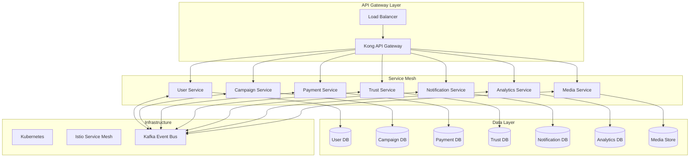
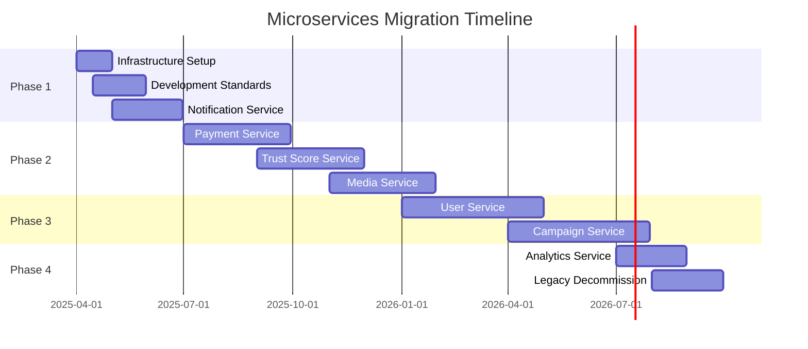

# Microservices Migration Strategy

## Executive Summary

The Blessed Horizon platform has achieved significant success as a monolithic application. To support future growth, international expansion, and increasing complexity, we propose a phased migration to a microservices architecture. This document outlines our comprehensive strategy for decomposing the current monolith into discrete, scalable services while maintaining system stability and continuous operation.

## Migration Objectives

### Primary Goals
1. **Scalability**: Enable independent scaling of high-traffic components
2. **Development Velocity**: Allow teams to work independently on services
3. **Technology Flexibility**: Use best-fit technologies for each service
4. **Fault Isolation**: Prevent cascading failures across the system
5. **Global Distribution**: Deploy services closer to users worldwide

### Success Metrics
- Reduce deployment time by 70%
- Achieve 99.99% uptime SLA
- Decrease time-to-market for new features by 50%
- Support 10x current transaction volume
- Enable 5 independent development teams

## Current State Analysis

### Monolith Components
1. **User Management**: Authentication, profiles, preferences
2. **Campaign System**: Creation, management, updates
3. **Payment Processing**: Donations, refunds, reconciliation
4. **Trust & Safety**: Scoring, moderation, verification
5. **Notifications**: Email, push, in-app messaging
6. **Analytics**: Reporting, insights, data processing
7. **Media Management**: Upload, processing, delivery

### Pain Points
- Deployment requires full application restart
- Database bottlenecks during peak traffic
- Testing complexity increases with each feature
- Technology lock-in limits optimization options
- Scaling requires duplicating entire application

## Target Architecture



## Migration Phases

### Phase 1: Foundation (Months 1-3)
**Goal**: Establish microservices infrastructure without disrupting production

1. **Infrastructure Setup**
   - Deploy Kubernetes cluster
   - Configure Istio service mesh
   - Set up API Gateway (Kong)
   - Implement centralized logging (ELK stack)
   - Deploy distributed tracing (Jaeger)

2. **Development Standards**
   - Define service communication protocols
   - Establish API versioning strategy
   - Create service templates
   - Set up CI/CD pipelines
   - Define monitoring standards

3. **Pilot Service: Notification Service**
   - Low-risk, well-defined boundaries
   - Clear API requirements
   - Minimal data dependencies
   - Measurable success criteria

### Phase 2: Core Services Extraction (Months 4-9)
**Goal**: Extract high-value services with careful data migration

1. **Payment Service**
   - Critical for business operations
   - Clear transactional boundaries
   - Stripe webhook handling
   - Payment reconciliation
   - Audit trail maintenance

2. **Trust Score Service**
   - CPU-intensive calculations
   - Independent scaling needs
   - Machine learning integration
   - Real-time scoring API

3. **Media Service**
   - Storage-intensive operations
   - CDN integration
   - Image processing pipeline
   - Video transcoding ready

### Phase 3: User Domain Services (Months 10-15)
**Goal**: Decompose user-related functionality

1. **User Service**
   - Authentication/Authorization
   - Profile management
   - Preference handling
   - OAuth integration

2. **Campaign Service**
   - Campaign CRUD operations
   - Workflow management
   - Search functionality
   - Recommendation engine

### Phase 4: Analytics & Optimization (Months 16-18)
**Goal**: Extract analytics and complete migration

1. **Analytics Service**
   - Event processing
   - Report generation
   - Data aggregation
   - BI tool integration

2. **Legacy Decommission**
   - Remove monolith code
   - Archive old systems
   - Update documentation
   - Team training completion

## Technical Decisions

### Service Communication
- **Synchronous**: REST APIs for request-response
- **Asynchronous**: Kafka for event-driven communication
- **Service Mesh**: Istio for service-to-service communication
- **API Gateway**: Kong for external API management

### Data Management
- **Database per Service**: Each service owns its data
- **Event Sourcing**: For audit trails and history
- **CQRS**: Separate read/write models where beneficial
- **Saga Pattern**: For distributed transactions

### Technology Stack
```yaml
Languages:
  - Go: High-performance services (Payment, Trust Score)
  - Node.js: API services (User, Campaign)
  - Python: ML/Analytics services
  - Rust: Media processing (future)

Databases:
  - PostgreSQL: Transactional data
  - MongoDB: Document storage
  - Redis: Caching and sessions
  - Elasticsearch: Search and analytics

Infrastructure:
  - Kubernetes: Container orchestration
  - Docker: Containerization
  - Helm: Package management
  - Terraform: Infrastructure as code
```

## Migration Patterns

### Strangler Fig Pattern
Gradually replace monolith functionality:
1. Route traffic through API Gateway
2. Implement new functionality in microservice
3. Redirect traffic to new service
4. Remove old functionality
5. Repeat for each component

### Database Decomposition
1. **Shared Database** (temporary)
2. **Database View Separation**
3. **Synchronized Writes**
4. **Application-level Joins**
5. **Event-driven Synchronization**
6. **Complete Separation**

### Anti-Corruption Layer
- Transform monolith data models to service models
- Maintain backward compatibility
- Version APIs appropriately
- Deprecate gracefully

## Risk Mitigation

### Technical Risks
| Risk | Mitigation Strategy |
|------|-------------------|
| Data Inconsistency | Implement distributed transaction patterns |
| Network Latency | Use caching, optimize service calls |
| Debugging Complexity | Comprehensive distributed tracing |
| Service Discovery | Use Kubernetes DNS and service mesh |
| Security Boundaries | Implement zero-trust networking |

### Operational Risks
| Risk | Mitigation Strategy |
|------|-------------------|
| Team Knowledge Gaps | Extensive training programs |
| Deployment Complexity | Automated CI/CD pipelines |
| Monitoring Overhead | Centralized observability platform |
| Cost Increase | Regular cost optimization reviews |
| Vendor Lock-in | Use open standards and tools |

## Team Structure

### Service Ownership
```
User Service Team (3 engineers)
- Frontend specialist
- Backend engineer
- DevOps engineer

Payment Service Team (4 engineers)
- Senior backend engineer
- Backend engineer
- Security specialist
- DevOps engineer

Platform Team (5 engineers)
- Infrastructure lead
- 2 SRE engineers
- Security engineer
- Data engineer
```

### Governance Model
- Service owners responsible for full lifecycle
- Platform team provides shared infrastructure
- Architecture guild for cross-cutting concerns
- Weekly sync meetings
- Quarterly architecture reviews

## Success Metrics

### Technical KPIs
- Service uptime: >99.95% per service
- API latency: <100ms p95
- Deployment frequency: >10 per day
- MTTR: <30 minutes
- Test coverage: >80%

### Business KPIs
- Feature delivery speed: 2x improvement
- System reliability: 99.99% availability
- Cost efficiency: 20% reduction in infrastructure costs
- Developer productivity: 50% increase
- Customer satisfaction: >4.5/5 rating

## Timeline & Milestones



## Investment Requirements

### Infrastructure Costs
- Kubernetes cluster: $5,000/month
- Monitoring tools: $2,000/month
- Development environments: $3,000/month
- Total: $10,000/month additional

### Personnel Investment
- 5 new hires over 18 months
- Training budget: $50,000
- Consulting: $100,000
- Total: $750,000 over project duration

### ROI Projections
- Break-even: Month 12
- Cost savings: 20% by Month 18
- Revenue increase: 30% from improved features
- 3-year ROI: 250%

## Conclusion

The migration to microservices represents a significant but necessary evolution of the Blessed Horizon platform. By following this phased approach, we can minimize risk while maximizing the benefits of a distributed architecture. The investment in microservices will position us for sustainable growth and technical excellence in the coming years.

## Next Steps

1. **Approval**: Secure stakeholder buy-in and budget
2. **Team Formation**: Hire key personnel and form teams
3. **Infrastructure**: Begin Phase 1 infrastructure setup
4. **Pilot Project**: Start Notification Service extraction
5. **Review Cycle**: Establish monthly progress reviews

This migration strategy provides a clear path forward while maintaining flexibility to adapt as we learn. Success depends on commitment, careful execution, and continuous improvement throughout the journey.
